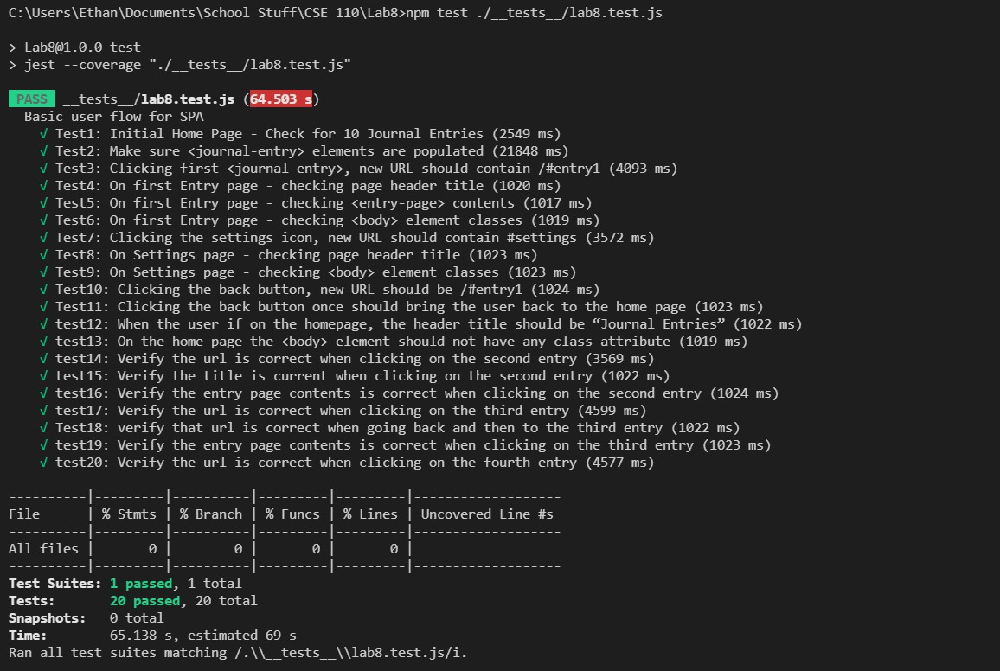
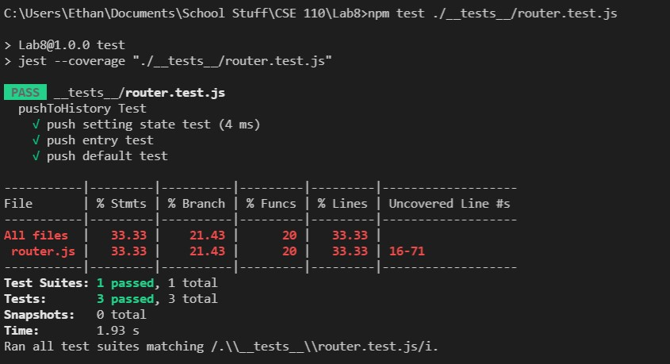
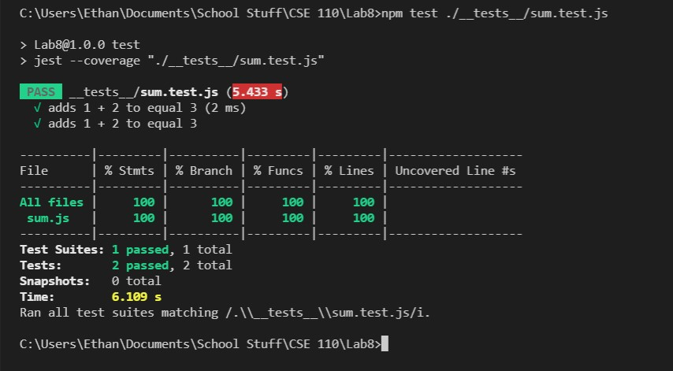

# Lab8_Starter
# Authors
Ethan Tan
## Check your understanding q's (FILL OUT)
1. In your own words: Where would you fit your automated tests in your Bujo project development pipeline? (just write the letter)

Would fit automated tests within a Github action that runs whenever code is pushed.

2. Would you use a unit test to test the “message” feature of a messaging application? Why or why not? For this question, assume the “message” feature allows a user to write and send a message to another user.

No. A messaging system is much too large to individually unit test.

3. Would you use a unit test to test the “max message length” feature of a messaging application? Why or why not? For this question, assume the “max message length” feature prevents the user from typing more than 80 characters

Yes. If you have a rule that you want users to follow then you should verify that this rule, that being max message length in this case, to be one that is enforced.

4. What do you expect to happen if we run our puppeteer tests with the field “headless” set to true?

If I ran the puppeteer tests with headless set to true, I expect puppeteer to run tests without browser UI.

5. What would your beforeAll callback look like if you wanted to start from the settings page before every test case?

beforeEach(async () = { 
  await page.click('header > img');
});

